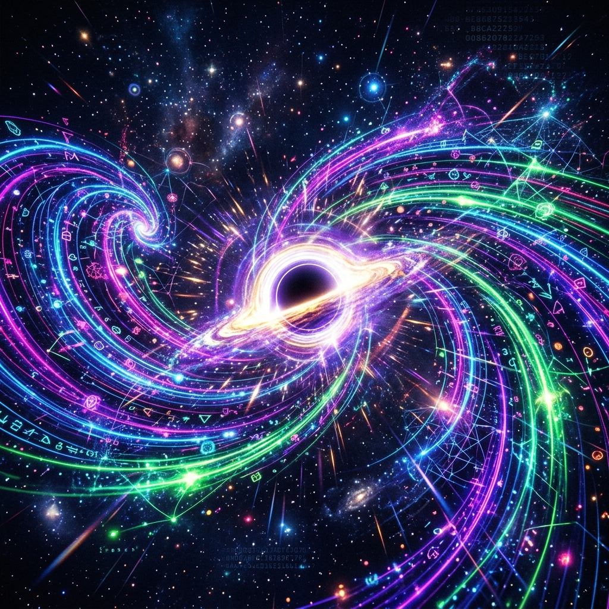

  
  <h1>MLX-QUANT 🚀</h1>
  
<strong>Bare-metal Tensor Quantization, Hardware Doorbells, and Astrophysical Computations.</strong>

---

## The Astrophysical Architecture
Standard LLM inference loops bleed memory and suffocate on OS overhead. We are bypassing the kernel entirely by routing raw Tensor data structures directly to the physical hardware using extreme astrophysical concepts:

### 1. The Magnetar (Memory & Thread Pinning)
Magnetars have insanely strong magnetic fields. We map this by using `mlock` to magnetically pin our Tensor Cache physical pages in RAM (zero page faults) and pinning execution threads exclusively to Apple Silicon Firestorm P-Cores.

### 2. The I/O Blackhole Portal
Zero-copy DMA! We bypass the CPU completely by `mmap`-ing NVMe SSD storage directly into the physical address space of our bare-metal Tensor Cache. Data materializes in VRAM instantly.

### 3. Redshifting (Dynamic Precision Downcasting)
As tensors travel across vast distances (like the PCIe bus), they stretch out and lose frequency, redshifting into lower precisions. We dynamically downcast FP16 -> INT8 -> INT4 in transit to save extreme amounts of bandwidth.

### 4. The 4D Polar Galaxy Queue & Compute Singularity
Multiple asynchronous spiral arms (Weights, Activations) continuously merge into an accretion disk ALU compute singularity. The Singularity executes our bare-metal INT4/INT8 Matrix Math kernels instantly by ringing the AMD MI300X (`0xE000_0000`) or Apple AGX (`0x280004000`) physical doorbells.

### 5. The Quasar (RDMA Output Jets)
Once the Singularity finishes the Matrix Math, it doesn't wait around. It instantly blasts the generated output tokens through a high-speed network socket via RDMA (Remote Direct Memory Access)—a relativistic jet of energy shooting directly to another machine's VRAM without touching the CPU.

## Modules
- `mlx-quant-linux`: The bare-metal Rust scaffolding containing `magnetar.rs`, `quasar.rs`, `redshift.rs`, `io_blackhole.rs`, and the Singularity router.
- `hw-ultra`: The underlying low-level abstractions powering this layer (see the `8b-is/hw-ultra` crate).

*Let's build the universe.*
