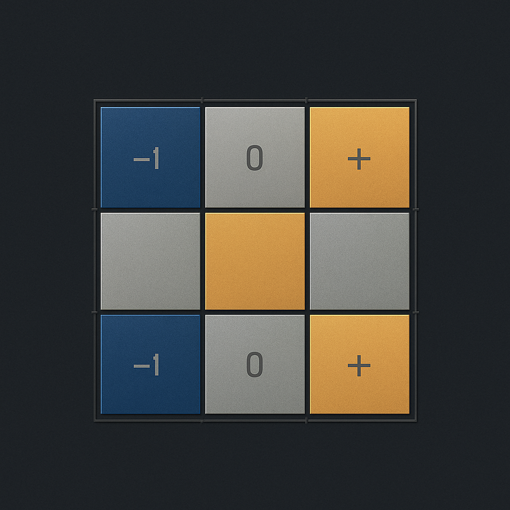

<p align="center">
  
</p>

# MLX-QUANT

**A standalone fork of [MLX](https://github.com/ml-explore/mlx) adding native ternary
(BitNet b1.58) quantization**, with real fused kernels on both CPU (SIMD) and
Apple Silicon GPU (Metal) — maintained by [8b-is](https://github.com/8b-is).
This fork is not intended to be upstreamed; see [CHANGELOG.md](CHANGELOG.md)
for the full history of what's been added and why.

Part of the **ayeOS mesh** — the GPU brain:

| Layer | Project |
|-------|---------|
| CPU (hearth) | [kernel8](https://github.com/8b-is/kernel8) |
| **GPU (brain)** | MLX-QUANT (this repo) |
| Coord | [vaked](https://github.com/8b-is/vaked) |
| Viz | [mlx-quant-viz](https://github.com/8b-is/mlx-quant-viz) |
| Daemon | [ayeOS](https://github.com/8b-is/ayeos) |

Tested on **Apple M3 Max** and **Apple M1 Pro** (Metal 4). All 260 tests pass on both machines.

<p align="center">
  
</p>

## What's a ternary weight?

Ternary quantization (from the [BitNet b1.58 paper](https://arxiv.org/abs/2402.17764))
stores every weight as one of exactly three values: **-1, 0, or +1**, plus a
single real-valued scale per group. That's roughly 2 bits per weight — 16x
smaller than fp32, 8x smaller than fp16 — while keeping the *real* zeros that
distinguish it from a full-precision-weights training simulation:

```python
import mlx.core as mx

w = mx.random.normal((4096, 4096))
w_q, scales = mx.quantize(w, group_size=64, bits=2, mode="ternary")

x = mx.random.normal((1, 4096))
y = mx.quantized_matmul(x, w_q, scales, group_size=64, bits=2, mode="ternary")
```

That's it — `mode="ternary"` on the same `mx.quantize`, `mx.dequantize`,
`mx.quantized_matmul`, and `mx.gather_qmm` API MLX already exposes for
`"affine"` and the `"mxfp4"`/`"mxfp8"`/`"nvfp4"` family.

## What's actually fused vs. composed

| Op | CPU | GPU (Metal) |
|---|---|---|
| `quantize` / `dequantize` | native SIMD kernel | native kernel |
| `quantized_matmul`, decode (`M=1`, `nn.Linear`-style) | M-tiled SIMD kernel | fused `qmv_fast` kernel |
| `quantized_matmul`, general shape | M-tiled SIMD kernel | fused `qmv`/`qvm` kernel |
| `quantized_matmul`, large batch (`M >= 32`) | M-tiled SIMD kernel | fused tiled GEMM (`qmm_t`, real `steel::BlockMMA` integration) |
| `quantized_matmul`, batched weights | correctness-first fallback | composed (`dequantize` + dense matmul) |
| `gather_qmm` (MoE) | correctness-first fallback | composed (`dequantize` + dense `gather_mm`) |

Measured, not assumed — see [BENCHMARKS.md](BENCHMARKS.md) for full numbers,
exact shapes, and reproduction steps on **Apple M3 Max** and **Apple M1 Pro**
(no other Apple Silicon chips tested yet). Every fused GPU kernel beats the
compose fallback it replaces, and the CPU SIMD kernel beats this codebase's
own best comparable `affine` bits=4 kernel by 1.8-2.3x. All measurements use
fp32 activations — fp16/bf16 comparisons haven't been benchmarked.

## Building from source

This fork isn't published to PyPI. Build the Python extension from a clone:

```bash
git clone https://github.com/8b-is/MLX-QUANT.git
cd MLX-QUANT
pip install -e .
```

Building the C++ library and test suite follows upstream MLX's own
[build documentation](https://ml-explore.github.io/mlx/build/html/install.html) —
nothing about the build system itself changed.

---

*Everything below this line is the original MLX project README, unmodified.*

# MLX

[**Quickstart**](#quickstart) | [**Installation**](#installation) |
[**Documentation**](https://ml-explore.github.io/mlx/build/html/index.html) |
[**Examples**](#examples)

[](https://circleci.com/gh/ml-explore/mlx)

MLX is an array framework for machine learning on Apple silicon,
brought to you by Apple machine learning research.

Some key features of MLX include:

- **Familiar APIs**: MLX has a Python API that closely follows NumPy. MLX
   also has fully featured C++, [C](https://github.com/ml-explore/mlx-c), and
   [Swift](https://github.com/ml-explore/mlx-swift/) APIs, which closely mirror
   the Python API. MLX has higher-level packages like `mlx.nn` and
   `mlx.optimizers` with APIs that closely follow PyTorch to simplify building
   more complex models.

- **Composable function transformations**: MLX supports composable function
  transformations for automatic differentiation, automatic vectorization,
  and computation graph optimization.

- **Lazy computation**: Computations in MLX are lazy. Arrays are only
  materialized when needed.

- **Dynamic graph construction**: Computation graphs in MLX are constructed
  dynamically. Changing the shapes of function arguments does not trigger
  slow compilations, and debugging is simple and intuitive.

- **Multi-device**: Operations can run on any of the supported devices
  (currently the CPU and the GPU).

- **Unified memory**: A notable difference from MLX and other frameworks
  is the *unified memory model*. Arrays in MLX live in shared memory.
  Operations on MLX arrays can be performed on any of the supported
  device types without transferring data.

MLX is designed by machine learning researchers for machine learning
researchers. The framework is intended to be user-friendly, but still efficient
to train and deploy models. The design of the framework itself is also
conceptually simple. We intend to make it easy for researchers to extend and
improve MLX with the goal of quickly exploring new ideas.

The design of MLX is inspired by frameworks like
[NumPy](https://numpy.org/doc/stable/index.html),
[PyTorch](https://pytorch.org/), [Jax](https://github.com/google/jax), and
[ArrayFire](https://arrayfire.org/).

## Examples

The [MLX examples repo](https://github.com/ml-explore/mlx-examples) has a
variety of examples, including:

- [Transformer language model](https://github.com/ml-explore/mlx-examples/tree/main/transformer_lm) training.
- Large-scale text generation with
  [LLaMA](https://github.com/ml-explore/mlx-examples/tree/main/llms/llama) and
  finetuning with [LoRA](https://github.com/ml-explore/mlx-examples/tree/main/lora).
- Generating images with [Stable Diffusion](https://github.com/ml-explore/mlx-examples/tree/main/stable_diffusion).
- Speech recognition with [OpenAI's Whisper](https://github.com/ml-explore/mlx-examples/tree/main/whisper).

## Quickstart

See the [quick start
guide](https://ml-explore.github.io/mlx/build/html/usage/quick_start.html)
in the documentation.

## Installation

MLX is available on [PyPI](https://pypi.org/project/mlx/). To install MLX on
macOS, run:

```bash
pip install mlx
```

To install the CUDA backend on Linux, run:

```bash
pip install mlx[cuda]
```

To install a CPU-only Linux package, run:

```bash
pip install mlx[cpu]
```

Checkout the
[documentation](https://ml-explore.github.io/mlx/build/html/install.html#)
for more information on building the C++ and Python APIs from source.

## Contributing

Check out the [contribution guidelines](https://github.com/ml-explore/mlx/tree/main/CONTRIBUTING.md) for more information
on contributing to MLX. See the
[docs](https://ml-explore.github.io/mlx/build/html/install.html) for more
information on building from source, and running tests.

We are grateful for all of [our
contributors](https://github.com/ml-explore/mlx/tree/main/ACKNOWLEDGMENTS.md#Individual-Contributors). If you contribute
to MLX and wish to be acknowledged, please add your name to the list in your
pull request.

## Citing MLX

The MLX software suite was initially developed with equal contribution by Awni
Hannun, Jagrit Digani, Angelos Katharopoulos, and Ronan Collobert. If you find
MLX useful in your research and wish to cite it, please use the following
BibTex entry:

```text
@software{mlx2023,
  author = {Awni Hannun and Jagrit Digani and Angelos Katharopoulos and Ronan Collobert},
  title = {{MLX}: Efficient and flexible machine learning on Apple silicon},
  url = {https://github.com/ml-explore},
  version = {0.0},
  year = {2023},
}
```
